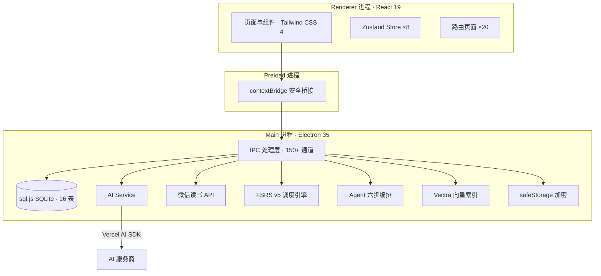

# 知行读书 (Zhixing Reader)

> **AI 驱动的阅读成长智能体** · Electron 桌面应用 · Anki 同源 FSRS v5 · 微信读书深度同步
>
> **v1.0.0 正式版** | 2026-07-28 | [📦 下载安装包](https://github.com/harryopo/zhixing-reader/releases) | [🌐 项目主页](https://harryopo.github.io/zhixing-reader)

[](https://github.com/harryopo/zhixing-reader/releases)
[](./LICENSE)
[](https://www.electronjs.org/)
[](https://react.dev/)
[](https://www.typescriptlang.org/)
[-00C853)](https://github.com/open-spaced-repetition/ts-fsrs)
[](./tests)
[]()

---

## 一、项目简介

**知行读书**是一款面向阅读成长场景的桌面应用，把「**微信读书同步 → AI 智能体理解 → 科学间隔复习 → 知识卡片体系化 → 英语学习**」完整闭环装进本地优先的 Electron 容器。

围绕"读了就忘、笔记散乱、想问无门、知道做不到"四大阅读痛点，给出**15 大功能模块 + 7 大核心创新**的完整解决方案。

> **面向所有阅读者，帮每一位读者构建起属于自己的自我成长型系统。**

| 维度 | 详情 |
|------|------|
| **形态** | Electron 三进程桌面应用（Main / Preload / Renderer）|
| **代码规模** | 52,000+ 行 TypeScript strict 代码 |
| **测试覆盖** | 667 用例 / 28 文件 / ≥ 85% 覆盖率（ai-service 94.6%）|
| **存储** | sql.js (SQLite WASM) · 16 张表 · Vectra 本地向量索引 |
| **核心能力** | 微信读书同步 · **FSRS v5** 间隔重复 · AI 智能体 · 知识卡片 · 词汇学习 |
| **算法** | **ts-fsrs@5.4.1**（open-spaced-repetition 官方，Anki 同源）|
| **打包** | electron-builder → Windows NSIS 安装包（**125MB**）|
| **License** | MIT（自由使用 / 修改 / 商用）|

---

## 二、核心亮点

- **微信读书生态整合** — 书架、划线、笔记、书评一键同步到本地，构建个人知识底座
- **FSRS v5 科学记忆** — 与 Anki 23.10+ 同源算法，19 组权重精确排期复习
- **AI 教学策略驱动** — 苏格拉底追问 + 费曼复述 + Bloom 难度自适应，不是问答机而是私教
- **本地优先 · 数据安全** — SQLite + Vectra + safeStorage，零遥测，AI 直连不过中转
- **ECDICT 离线词典** — 13.6MB 词典内置，悬停即查，支持英语学习全闭环

---

## 三、7 大核心创新

> **知行读书如何把"读了就忘、笔记散乱、想问无门、知道做不到"四大阅读痛点，打成"读→记→懂→用"完整闭环？**

| # | 创新点 | 一句话 | 关键指标 |
|---|--------|--------|----------|
| **1** | **方法论自动注入 Agent**（行业首创） | AI 回答时自动引用书中方法论，实时追踪掌握度 | mastery_level 追踪 / 一键导出 Skill |
| **2** | **5 维 ContextBuilder**（预算制懒加载） | 书籍/方法论/卡片/记忆/画像 5 维按需注入 | **Token 节省 33%-55%**（中位数 38%）|
| **3** | **FSRS v5 (DSR) 同源科学记忆引擎** | 集成 ts-fsrs 5.4.1 官方库（Anki 23.10+ 同源）| 保持率比 SM-2 **高 20-30%** |
| **4** | **本地优先架构 · 数据主权还给用户** | sql.js + Vectra + safeStorage 三重本地化 | **零遥测** / AI 直连不过中转 |
| **5** | **ECDICT 离线词典 + 语境化英语学习** | 13.6MB 词典 + 6 类词形还原 + 每日外刊 | **O(1) 查询** / 6 万词条 |
| **6** | **多模型深度思考归一化** | DeepSeek R1 / OpenAI / Anthropic 三种推理格式统一解析 | 用户无感切换任意模型 |
| **7** | **Skill 一键生成** | 方法论自动导出为可复用 Skill 模板 | 知识从阅读到应用闭环 |

### 5 维 ContextBuilder 详细预算

| 优先级 | 构建器 | 数据源 | Token 预算 |
|--------|--------|--------|------------|
| 90 | 书籍内容 | Vectra 语义搜索 → 关键词回退 | 1500 |
| 80 | 方法论 | 相关性评分 Top 5 | 1000 |
| 70 | 知识卡片 | 相关性评分 Top 10 | 800 |
| 50 | 长期记忆 | 相关记忆 3 条 + 摘要 | 500 |
| 40 | 用户画像 | 动态生成 | 200 |
| **合计** | - | - | **4000** |

**三条硬规则**：① 预算不足时低优先级自动跳过；② 每个构建器独立失败不拖垮整体（fail-soft 柔性容错）；③ 超预算截断并显式标记 `...(已截断)`。

---

## 四、15 大功能模块

| # | 模块 | 路由 | 核心能力 |
|---|------|------|----------|
| 1 | 主页 | `/` | 数据卡片 + 今日待复习 + 推荐文章 |
| 2 | 书架 | `/bookshelf` | 微信读书同步 + 阅读进度 |
| 3 | 书籍详情 | `/bookshelf/:id` | 笔记/卡片/方法论/讨论 多 Tab |
| 4 | 笔记 | `/notes` | 全书笔记检索 + 高亮原文 + Markdown 导出 |
| 5 | AI 对话 | `/chat` | 多会话 + 流式 + 深度思考 + 方法论注入 + RAG 溯源 |
| 6 | 方法论 | `/methodologies` | 独立方法论管理 + 掌握度追踪 |
| 7 | 知识卡片 | `/knowledge-cards` | 卡片体系化管理 + 语境化知识提取 |
| 8 | 每日学习 | `/daily-learning` | 英文外刊 + AI 翻译对照 + 悬停查词 |
| 9 | 生词本 | `/vocabulary` | ECDICT 查询 + 学习阶段 + CSV/Anki 导出 |
| 10 | 数据统计 | `/stats` | 阅读趋势 + 学习热力图 + 12 周复习可视化 |
| 11 | Token 监控 | `/token-usage` | 服务商/功能双维用量 + 成本核算 |
| 12 | 个人中心 | `/profile` | 阅读画像 + 微信读书资料继承 |
| 13 | 设置 | `/settings` | AI 多服务商热切换 + 数据导入导出 |
| 14 | 智能体编排 | `/agent-orchestration` | 六步流水线可视化 + 意图/策略矩阵 + 提示词模板 |
| 15 | Skill 生成 | 对话/方法论内 | 方法论一键导出为可复用 Skill |

---

## 五、Agent 六步编排流水线

> **灵魂模块**：为什么同样接大模型，知行读书的 AI 是"私教"而别人的是"问答机"？

```
   用户输入
      ↓
  ┌─────────────────────────────────────────────────────────────┐
  │  ① 意图分类         (1-5ms)      本地关键词打分 + 负向惩罚   │
  │  ② 策略选择         (<1ms)       意图 → 教学模式映射          │
  │  ③ 难度自适应       (<1ms)       Bloom 状态机 + 升降级规则   │
  │  ④ 5 维上下文构建   (50-200ms)   RAG 优先 + 关键词回退       │
  │  ⑤ 提示组装         (<1ms)       4 段动态拼装                │
  │  ⑥ 流式响应         (网络)       Vercel AI SDK streamText   │
  └─────────────────────────────────────────────────────────────┘
      ↓
   AI 打字机输出
```

**本地决策链路 52-207ms**（步骤 ①-⑤），**用户输入到 AI 开始输出"几乎无白屏感"**。

**4 类意图**：
- `knowledge_query` 知识查询 → 直接回答（Bloom 1 记忆）
- `deep_discussion` 深度讨论 → 苏格拉底追问（Bloom 3 应用）
- `teaching_practice` 教学实践 → 费曼复述（Bloom 2 理解）
- `casual_chat` 闲聊问候 → 直接回答

**对话后自动学习**：每轮对话完成后自动更新概念掌握度、提取长期记忆、更新方法论掌握度——**系统越用越懂你**。

---

## 六、技术栈

| 层 | 选型 | 版本 | 选型理由 |
|----|------|------|----------|
| **桌面壳** | Electron | 35.x | 跨平台桌面开发事实标准 |
| **构建工具** | electron-vite | 2.x | Vite 5 + HMR，三进程并行开发 |
| **UI 框架** | React | 19.x | Concurrent Mode、Suspense、自动批处理 |
| **路由** | React Router | 7.x | 嵌套路由 + Data Router |
| **类型** | TypeScript | 5.6 strict | 52,000+ 行 strict 模式 |
| **样式** | Tailwind CSS | 4.x | 原子化 CSS + PostCSS + 设计 Token |
| **状态** | Zustand | 5.x | 轻量（< 3KB）、hooks-first |
| **数据库** | sql.js | 1.14 | SQLite WASM，跨平台一致 |
| **向量索引** | Vectra | 0.15 | 纯 TS 本地向量库 |
| **间隔重复** | **ts-fsrs** | **5.4.1** | **FSRS v5 DSR，与 Anki 23.10+ 同源** |
| **AI SDK** | Vercel AI SDK + 自研 SSE | 7.x | 多服务商统一接口 + 流式 + 深度思考归一化 |
| **AI 服务商** | 火山引擎 / DeepSeek / OpenAI / Anthropic / Moonshot | - | 热切换，Key 本地加密 |
| **图表** | ECharts / Recharts | 5.5 / 3.8 | 复杂 / 简单场景分用 |
| **加密** | Electron safeStorage | 内置 | OS 系统级加密（DPAPI / Keychain）|
| **测试** | Vitest | 2.x | 667 用例，≥ 85% 覆盖率门禁 |
| **打包** | electron-builder | 25.x | Windows NSIS 安装包 |
| **词典** | ECDICT | 自建 | 13.6MB JSON，~6 万词条，CEFR 分级 |

---

## 七、技术架构图



---

## 八、FSRS v5 算法集成

知行读书集成了 **ts-fsrs 5.4.1**（open-spaced-repetition 官方库），与 Anki 23.10+ 使用同一套 FSRS v5 (DSR) 算法。该模型基于 **19 组权重参数** 和 **DSR 三变量模型**（Stability 稳定性 / Difficulty 难度 / Retrievability 可提取性），通过完整遗忘曲线公式 `(1 + factor·t/9S)^decay` 精确预测记忆保持率。

**核心能力**：

| 能力 | 说明 |
|------|------|
| **4 评分预览** | `repeat()` 一次返回 Again/Hard/Good/Easy 四种结果，用户可在评分前查看未来间隔 |
| **Anki 数据互通** | 与 Anki FSRS 插件同一算法、同一 schema，卡片可互相导入导出 |
| **0 依赖 < 30KB** | 纯 TypeScript 实现，无第三方依赖，包体积极小 |
| **API 100% 兼容** | 内部算法替换为 ts-fsrs，对外接口零变更，原有调用方无需修改 |

项目实现了完整的适配层（`electron/fsrs-engine.ts`，900+ 行），包括 Card ↔ FsrsCard 双向转换、step 学习阶段映射、枚举对齐等，确保与 ts-fsrs 正确集成的同时保持对外 API 稳定。升级后 **38 个单元测试** 全部通过（18 个原有冒烟测试 + 20 个适配层测试）。

---

## 九、目录结构

```
zhixing-reader/
├── electron/                                # Main 进程
│   ├── main.ts                              # 入口
│   ├── preload.ts                           # contextBridge（423 行）
│   ├── ipc.ts                               # IPC handlers（657 行）
│   ├── database.ts                          # sql.js DB（1967 行）
│   ├── fsrs-engine.ts                       # ⭐ FSRS v5 适配层（900+ 行）
│   ├── ai-service.ts                        # AI 卡片/摘要（800+ 行）
│   ├── ai-sdk-service.ts                    # AI 流式（500+ 行）
│   ├── weread-api.ts                        # 微信读书 Skill API（1000+ 行）
│   ├── weread-sync-manager.ts               # 同步管理（300+ 行）
│   ├── agent/                               # ⭐ AI Agent 编排
│   │   ├── orchestrator.ts                  # 六步流水线主控
│   │   ├── context-manager.ts               # 5 维构建器协调
│   │   ├── intent-classifier.ts             # 4 类意图分类
│   │   ├── strategy-selector.ts             # 教学策略
│   │   ├── state-tracker.ts                 # Bloom 状态机
│   │   ├── system-prompt.ts                 # 4 段动态拼装
│   │   └── builders/                        # 5 个 ContextBuilder
│   ├── repositories/                        # 仓储层
│   ├── services/                            # 业务服务（RAG / 记忆 / 嵌入）
│   └── types/                               # 实体类型
├── src/renderer/                            # Renderer 进程（React）
│   └── src/
│       ├── pages/                           # 20 个路由页面
│       ├── components/                      # UI 组件
│       ├── stores/                          # 8 个 Zustand Store
│       ├── admin-charts.tsx                 # ECharts 6 图
│       └── echarts-theme-tailwind.ts        # 主题映射
├── src/shared/                              # 跨进程共享（类型 + IPC 通道常量）
├── tests/                                   # Vitest 单元测试（667 用例）
├── resources/
│   ├── dictionary.json                      # ECDICT 13.6MB
│   ├── icon.ico / icon.png
├── landing/                                 # 宣传页源码（GitHub Pages 部署）
├── AGENTS.md                                # AI Agent 入口
├── CLAUDE.md                                # AI 辅助开发配置
├── CHANGELOG.md
├── CONTRIBUTING.md
├── CODE_OF_CONDUCT.md
├── FAQ.md
├── LICENSE                                  # MIT
├── PRIVACY.md
└── README.md
```

---

## 十、性能画像

| 指标 | 数值 | 说明 |
|------|------|------|
| 冷启动 → 主页可交互 | **< 1.0s** | 三进程预加载 |
| 路由懒加载（Code Splitting） | **80ms/页** | Vite manualChunks |
| 词典首次加载 | **150ms** | 13.6MB JSON → 内存 |
| 向量索引首次构建 | **200-500ms** | 取决于划线数 |
| 意图分类 | **1-5ms** | 本地关键词打分 |
| 5 维上下文构建 | **50-200ms** | RAG 优先 + 关键词回退 |
| **Agent 本地决策合计** | **52-207ms** | 步骤 ①-⑤ 全本地 |
| AI 流式首 token | **500-2000ms** | 取决于服务商 |
| 后续 token 速率 | **30-80 token/s** | 中文 |

---

## 十一、本地优先与安全合规

| 数据类别 | 存储位置 | 是否离开本机 |
|----------|----------|--------------|
| 用户输入（消息/笔记/评分） | 本地 SQLite | ❌ 否 |
| 微信读书同步数据 | 本地 SQLite | ❌ 否 |
| AI 请求上下文 | 发送至用户自选的 AI 服务商 | ✅ 仅此一项，**直连不过中转** |
| 系统生成（卡片/方法论/记忆） | 本地 SQLite | ❌ 否 |
| 向量索引 | Vectra 本地文件 | ❌ 否 |
| API Key | safeStorage 加密 | ❌ 否 |

**离线可用场景**：除"微信读书同步"和"AI 对话"外，复习 / 笔记 / 卡片 / 词典 / 生词本全部离线可用。

**零遥测** —— 项目不含任何分析 / 追踪 / 广告 SDK，不向任何第三方服务器发送用户数据。

**Electron safeStorage 系统级加密**：Windows DPAPI / macOS Keychain / Linux libsecret。

**合规性**：遵循微信读书开放平台使用条款，符合《个人信息保护法》相关规定——用户数据全部本地存储，AI 请求仅发送用户自选服务商，零遥测零埋点。

---

## 十二、快速开始

1. **下载安装** — 从 [GitHub Releases](https://github.com/harryopo/zhixing-reader/releases) 下载 `ZhixingReader-Setup-1.0.0.exe`（Windows，125MB）
2. **配置 AI** — 设置页选择 AI 服务商（火山引擎 / DeepSeek / OpenAI / Anthropic / Moonshot），填入 API Key
3. **连接微信读书** — 设置页填入微信读书 API Key，同步书架与划线数据
4. **开始使用** — 浏览书架、AI 对话、知识卡片复习、每日英语学习

> 除 AI 对话和微信读书同步需联网外，其余功能全部离线可用。

---

## 十三、开发与构建

```bash
# 安装依赖（使用 npmmirror 镜像）
npm install

# 开发模式（Vite 端口 5275 + Electron 自动开）
npm run dev

# 质量门禁（提交前必跑）
npm run lint            # ESLint
npm run typecheck       # tsc --noEmit
npm run test            # Vitest（含覆盖率）
npm run build           # 三进程编译
npm run verify          # 一键跑上面四项

# 打包 Windows NSIS 安装包
npm run package:win
# → 生成 installer/ZhixingReader-Setup-1.0.0.exe (125MB)

# 词典（仅开发者）
npm run build-dict      # 从 ecdict.db 重新提取 dictionary.json
```

**提交顺序**：`lint` → `typecheck` → `test` → `build`（**全绿才可提交**）。

### ESLint 规则分级策略

| 规则级别 | 规则 | 说明 |
|----------|------|------|
| **error** | `complexity` (≤15) | 函数圈复杂度硬约束 |
| **error** | `max-params` (≤6) | 函数参数数量 |
| **error** | `prefer-const` + `eqeqeq` | 强制 const / 强制 === |
| **warn** | `max-lines` (≤500) | 单文件行数 |
| **warn** | `max-lines-per-function` (≤80) | 单函数行数 |
| **warn** | `max-depth` (≤4) | 嵌套深度 |

---

## 十四、相关链接

| 资源 | 链接 |
|------|------|
| 📦 安装包下载 | https://github.com/harryopo/zhixing-reader/releases |
| 🌐 项目主页 | https://harryopo.github.io/zhixing-reader |
| 🐛 Issue 反馈 | https://github.com/harryopo/zhixing-reader/issues |
| 📝 更新日志 | [CHANGELOG.md](CHANGELOG.md) |
| ❓ 常见问题 | [FAQ.md](FAQ.md) |
| 🔒 隐私政策 | [PRIVACY.md](PRIVACY.md) |
| 🤝 贡献指南 | [CONTRIBUTING.md](CONTRIBUTING.md) |
| 📋 行为准则 | [CODE_OF_CONDUCT.md](CODE_OF_CONDUCT.md) |
| 📄 开源许可证 | [LICENSE](LICENSE) |
| 🤖 Agent 协作规范 | [AGENTS.md](AGENTS.md) |
| 🧠 AI 辅助开发配置 | [CLAUDE.md](CLAUDE.md) |

### 参考资源

| 资源 | 链接 |
|------|------|
| ts-fsrs（官方）| https://github.com/open-spaced-repetition/ts-fsrs |
| FSRS 算法论文 | https://github.com/open-spaced-repetition/fsrs4anki |
| Anki FSRS 插件 | https://docs.ankiweb.net/deck-options.html#fsrs |
| Vectra 向量库 | https://github.com/Stevenic/vectra |
| sql.js | https://github.com/sql-js/sql.js |
| Vercel AI SDK | https://sdk.vercel.ai/docs |
| Electron 安全 | https://www.electronjs.org/docs/latest/tutorial/security |
| ECDICT 词典 | https://github.com/skywind3000/ECDICT |

---

## 十五、变更记录

| 日期 | 版本 | 变更 | 作者 |
|------|------|------|------|
| 2026-07-28 | v1.0.0 | 文档体系完善：技术白皮书（提交2/3）+ README 更新到核心亮点 + 15 大模块 | 张子涵 |
| 2026-07-25 | v1.0.0 | 首个正式版本（含 FSRS v5 / ECharts / 667 测试），安装包见 [Releases](https://github.com/harryopo/zhixing-reader/releases) | 张子涵 |

历史迭代明细见 [CHANGELOG.md](CHANGELOG.md)。

---

## 十六、贡献指南

我们欢迎任何形式的贡献：Bug 报告、功能建议、文档完善、代码修复、UI/UX 改进。

**快速参与**：

1. 📖 阅读 [CONTRIBUTING.md](CONTRIBUTING.md) 了解开发环境搭建、提交规范、PR 流程
2. 🤝 查看 [GitHub Issues](https://github.com/harryopo/zhixing-reader/issues) 中带 `good first issue` 标签的入门 Issue
3. ✅ 提交 PR 前请确保 `npm run verify` 全绿（lint / typecheck / test / build）
4. 📝 Commit message 遵循 [Conventional Commits](https://www.conventionalcommits.org/zh-hans/v1.0.0/) 规范

**行为准则**：参与本项目即代表你同意遵守 [Code of Conduct](CODE_OF_CONDUCT.md)。请在所有交流中保持友善与尊重。

---

## 十七、开源许可证

本项目基于 [**MIT License**](LICENSE) 开源，允许自由使用、修改、分发、商用，只需保留版权声明与许可证文本。

### 主要依赖许可证

| 依赖 | 版本 | 许可证 |
|------|------|--------|
| Electron | 35 | MIT |
| React | 19 | MIT |
| TypeScript | 5.6 | Apache-2.0 |
| ts-fsrs | 5.4.1 | MIT |
| sql.js | 1.14 | MIT |
| Tailwind CSS | 4 | MIT |
| Zustand | 5 | MIT |
| Apache ECharts | 5.5.1 | Apache-2.0 |
| Recharts | 3.8.1 | MIT |
| Vitest | 2 | MIT |
| electron-builder | 25 | MIT |
| Vercel AI SDK | - | Apache-2.0 |

> 完整依赖许可证清单可通过 `npx license-checker --summary` 生成。

### 致谢

本项目站在巨人的肩膀上，特别感谢：

- [open-spaced-repetition/ts-fsrs](https://github.com/open-spaced-repetition/ts-fsrs) —— FSRS v5 算法的 TypeScript 实现（Anki 同源）
- [Electron](https://www.electronjs.org/) —— 跨平台桌面应用框架
- [React](https://react.dev/) —— UI 框架
- [Apache ECharts](https://echarts.apache.org/) —— 数据可视化库
- [sql.js](https://github.com/sql-js/sql.js) —— SQLite WASM 编译
- 微信读书开放平台 —— Skill API 让"用户阅读资产归用户"成为可能

---

## License

本项目基于 [MIT License](LICENSE) 开源。

Copyright © 2026 张子涵 · 深圳信息职业技术大学

---

*最后更新：2026-07-28 | 与 v1.0.0 发布版代码一致*
